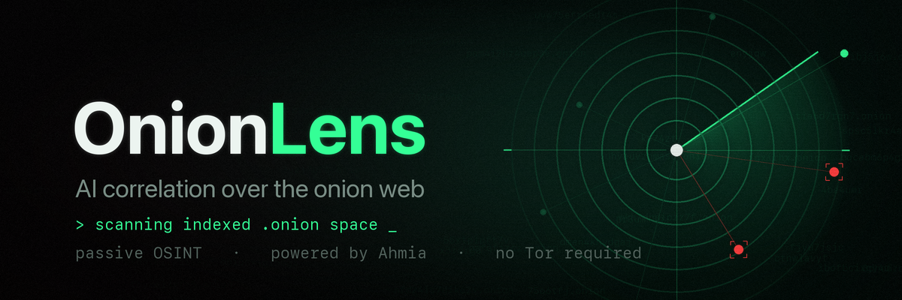

<p align="center">
  
</p>

# OnionLens

[](https://github.com/cparnin/onion-lens/actions/workflows/ci.yml)
[](https://github.com/cparnin/onion-lens/actions/workflows/security.yml)


An AI correlation layer over existing onion search engines. Ask in plain
English, get back correlated findings instead of a raw keyword dump.

OnionLens does not crawl the dark web. It piggybacks on
[Ahmia](https://ahmia.fi), a clearnet search engine that already indexes and
filters onion services, then adds the part the existing engines lack: an AI pass
that clusters results, extracts shared entities, flags likely scam or mirror
duplicates, and suggests follow-up searches.

## What it is and is not

- It is a passive OSINT and threat-intelligence lens. It reads publicly indexed
  metadata (titles, descriptions, addresses).
- It finds **where** something lives and what it claims to be. It does not log
  into anything or view content behind registration or paywalls.
- It never touches child sexual abuse material. See [Safety](#safety).

## How it works

```
your query
  -> Ahmia (clearnet, no Tor needed)
  -> safety screen + dedupe
  -> clearnet intel: HIBP breach catalog, breach-news RSS, ransomware leak-site tracker
  -> local entity extraction (wallets, emails, PGP, onion links)
  -> persistent knowledge base (SQLite FTS5 + local embeddings, fully local)
  -> AI correlation (Claude): clusters, entities, likely duplicates, follow-ups
```

Correlation runs before the table is printed, so results the AI judges to be
keyword-collision noise (unrelated to the query's intent) are dimmed in place.
Numbering never changes: cluster and flag notes always refer to the same rows.

The intel sources are passive, public, and unauthenticated: the Have I Been
Pwned breach catalog, breach-news RSS feeds (databreaches.net,
BleepingComputer), and the ransomwatch leak-site tracker. They surface the
real-world breach or incident behind what onion vendors are selling, and the
AI uses them as labeled context when correlating. Responses are cached on disk
(a day for catalogs, an hour for news) so repeat runs cost one fetch.

Full diagram in [docs/architecture.md](docs/architecture.md).

## Install

Requires Python 3.10+.

```bash
git clone https://github.com/cparnin/onion-lens.git
cd onion-lens
python3 -m venv .venv && source .venv/bin/activate
pip install -e .
cp .env.example .env      # then paste your Anthropic key into .env
```

No Tor is required. Ahmia is reached over normal HTTPS.

## Usage

```bash
onionlens "ransomware leak sites"
onionlens "vendor handle acme" --limit 40
onionlens "breach forum" --no-ai      # skip the AI step, still get results + entities
onionlens "stolen ids" --no-intel     # skip the clearnet breach/news/leak-site feeds
onionlens recall "driver license"     # search the local knowledge base: no network, no cost
```

Every run stores results in a local `onionlens.db` so correlation improves as
your knowledge base grows across sessions. `onionlens recall` searches that
history (past onion sightings and stored breach intel, hybrid keyword +
semantic) and shows how long ago each row was stored; onion services churn
fast, so old sightings are history, not live addresses.

## Writing good searches

Ahmia is a full-text search engine that matches the **words** in your query
against indexed site titles and descriptions. A few things follow from that:

- **It is OR, not AND.** Every word is matched independently and results are
  ranked by relevance, so a page that matches only one of your words still
  comes back. Adding words *widens* the result set (pages matching more words
  just rank higher); it does not narrow to the intersection. There is no way to
  require all terms.
- **There are no operators.** `+`, `-`, quotes, and `AND`/`OR` are treated as
  literal words, not syntax. `alpha + bravo` searches for `alpha`, `+`, and
  `bravo`.
- **One or two distinctive keywords beat a long phrase.** If you want the
  overlap of several ideas, pick the single rarest word and skim the rest by
  eye. A three-word query returns everything matching any of the three.
- **Use the vocabulary the sites use.** Listings describe themselves with their
  own market jargon, not plain English, so search those terms directly.
- **Zero results means your words are not in the index, not that nothing
  exists.** Broaden to a single common term and work down from there.

Every run prints a one-line hint about how your query landed (result count,
whether you hit `--limit`, and whether a long query is widening the search), so
you can adjust and re-run.

## Cost and size guardrails

Using the default model (`claude-haiku-4-5`), a typical query costs about a
cent. The knowledge base uses local SQLite full-text search plus local embeddings
(fastembed, a one-time ~130MB model download), so storing and searching past
results costs nothing. Heavy daily use lands in the low single
digits of dollars per month. Every run prints exactly what it cost.

Built-in limits keep both the bill and the database bounded:

- `--limit` caps results fetched per run (default 25, hard ceiling 100).
- Only the first `max_correlate` results (default 40) are sent to the AI, and
  descriptions are truncated, so per-run token cost is bounded.
- The knowledge base is capped at `max_rows` (default 5000, set via
  `ONIONLENS_MAX_ROWS`). Oldest rows are pruned on every write, so the SQLite
  file cannot run away. At the default cap the database stays around 30-40 MB.
- Intel records are capped separately, per source (`max_intel_rows`, default
  500 each), so daily news churn can never evict onion sighting history.
  At most `max_intel` (default 8) records per source are shown and sent to the
  AI, so intel context adds only a few thousand input tokens per run.

## Safety

OnionLens refuses to index, store, or surface CSAM under any circumstances. Two
layers enforce this: Ahmia filters upstream, and a local gate blocks
abuse-category queries and results before storage or AI. Details in
[docs/security.md](docs/security.md).

## Roadmap

Torch and other sources, an interactive REPL, and scheduled monitoring are
planned. See [docs/roadmap.md](docs/roadmap.md).

## Legal and ethical use

This tool is for authorized security research, threat intelligence, and OSINT.
You are responsible for complying with the laws and policies that apply to you.
Do not use it to access, transact in, or participate in criminal activity.

## License

MIT. See [LICENSE](LICENSE).
