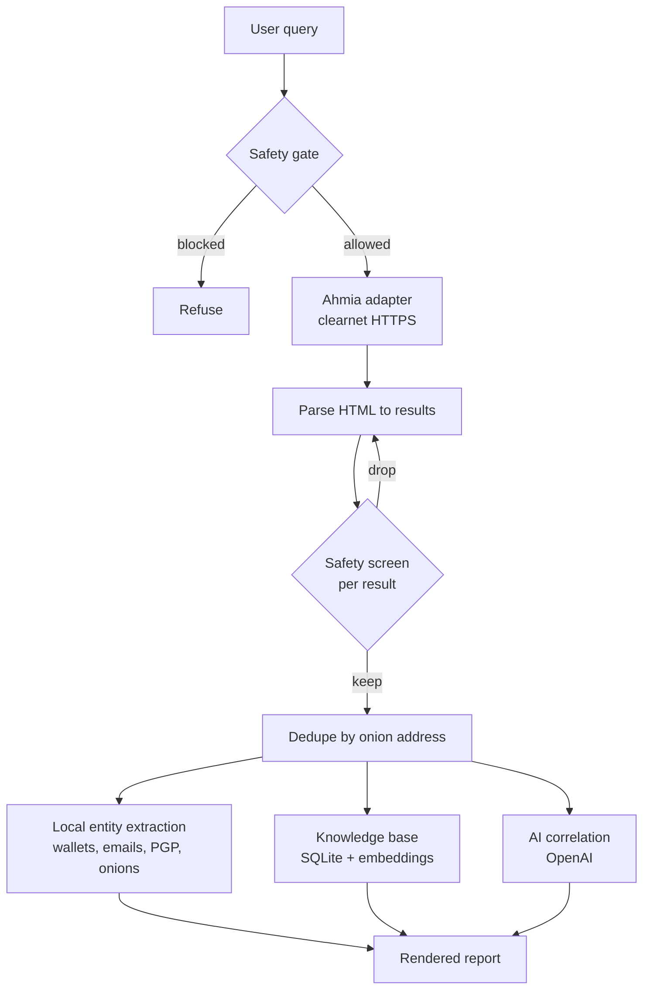

# Architecture

OnionLens is a thin, modular pipeline. Each stage is small and replaceable.

## Pipeline

## Stages

1. **Safety gate.** The query is screened before any network call. Abuse-category
   queries are refused outright.
2. **Ahmia adapter** (`search/ahmia.py`). Sends one clearnet HTTPS request to
   Ahmia, rate limited and with a descriptive User-Agent. No Tor involved.
3. **Parse.** Defensive HTML parsing extracts title, onion address, description,
   and last-seen date. This is the only stage coupled to Ahmia's markup, so
   engine changes are isolated here.
4. **Per-result screen.** Every result passes the safety gate again before it can
   be stored or correlated.
5. **Dedupe** (`models.py`). Results are keyed by bare onion address so mirrors
   surfaced under different URLs collapse to one entry.
6. **Entity extraction** (`extract.py`). Pure local regex. Runs without any API
   call, so `--no-ai` still returns structured value.
7. **Knowledge base** (`store.py`). SQLite plus numpy cosine over stored
   embeddings. No external vector database. Accumulates across sessions.
8. **AI correlation** (`correlate.py`). One OpenAI call returns clusters, shared
   entities, likely duplicates or scams, and suggested follow-ups as JSON.

## Why piggyback instead of crawl

Discovery is the hard, expensive, and legally fraught part of a dark web index.
Ahmia already does it and filters abuse material while doing so. Building on it
gives useful coverage in days instead of quarters, and keeps the project on the
passive-collection side of the line.

## Adding an engine

Implement the `SearchEngine` interface in `search/base.py` and return
`SearchResult` objects. Nothing downstream needs to change. This is how Torch
will be added (see [roadmap.md](roadmap.md)).
