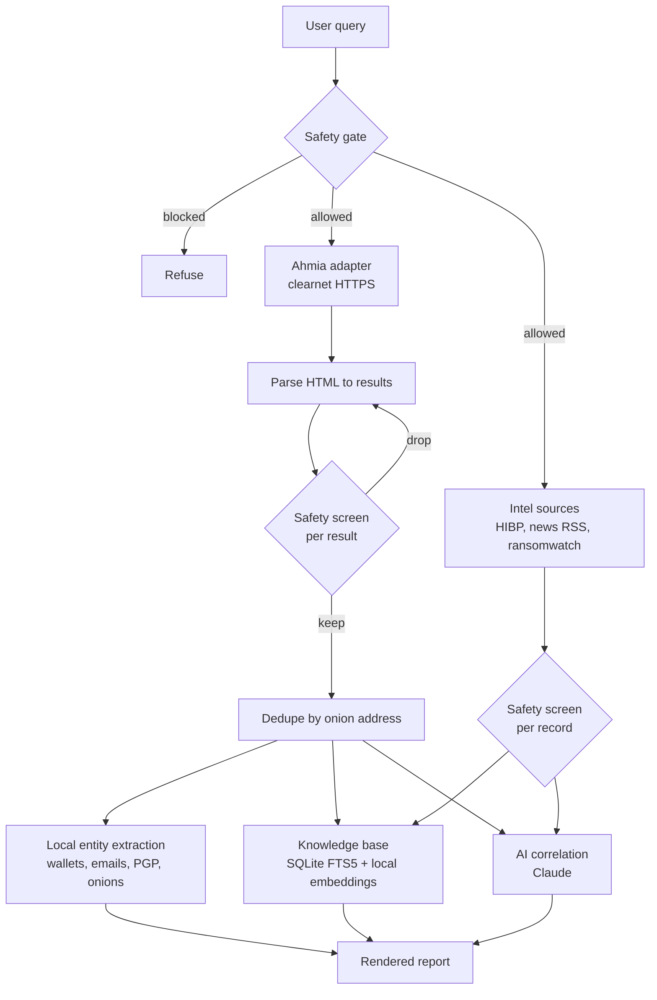

# Architecture

OnionLens is a thin, modular pipeline. Each stage is small and replaceable.

## Pipeline

## Stages

1. **Safety gate.** The query is screened before any network call. Abuse-category
   queries are refused outright.
2. **Ahmia adapter** (`search/ahmia.py`). Sends one clearnet HTTPS request to
   Ahmia, rate limited and with a descriptive User-Agent. No Tor involved.
3. **Parse.** Defensive HTML parsing extracts title, onion address, description,
   and last-seen date. This is the only stage coupled to Ahmia's markup, so
   engine changes are isolated here.
4. **Per-result screen.** Every result passes the safety gate again before it can
   be stored or correlated.
5. **Dedupe** (`models.py`). Results are keyed by bare onion address so mirrors
   surfaced under different URLs collapse to one entry.
6. **Entity extraction** (`extract.py`). Pure local regex. Runs without any API
   call, so `--no-ai` still returns structured value.
7. **Knowledge base** (`store.py`). Hybrid search: SQLite FTS5 with BM25 for
   exact keywords, plus local embeddings (fastembed, ONNX) for fuzzy semantic
   matches, merged with reciprocal rank fusion. Fully local, no API calls.
   Degrades to keyword-only if the embedding model is unavailable.
8. **AI correlation** (`correlate.py`). One Anthropic API call (Claude) returns
   clusters, shared entities, likely duplicates or scams, suggested follow-ups,
   and a per-result relevance verdict (the `unrelated` list) as schema-enforced
   JSON via structured outputs. Correlation runs before the table renders so
   unrelated rows can be dimmed in place; row numbering is never reordered, so
   the model's positional references stay correct.
9. **Intel sources** (`intel/`). Clearnet context feeds, all passive, public,
   and unauthenticated: the HIBP breach catalog, breach-news RSS
   (databreaches.net, BleepingComputer), and the ransomwatch leak-site
   tracker. Records have no onion address, so they live in their own
   `intel` table (pruned per source, `max_intel_rows` each, so a chatty feed
   can only evict its own history) and are fed to correlation as labeled
   context, never mixed into the numbered result list. Fetches are cached on
   disk with a TTL, and a stale cache is served when the network fails.
10. **Recall** (`onionlens recall <query>`). Hybrid keyword + semantic search
    over the local knowledge base, both onion sightings and stored intel.
    Fully local, no API cost. Each hit shows its stored age, because onion
    services churn fast and an old sighting is history, not a live address.

## Why piggyback instead of crawl

Discovery is the hard, expensive, and legally fraught part of a dark web index.
Ahmia already does it and filters abuse material while doing so. Building on it
gives useful coverage in days instead of quarters, and keeps the project on the
passive-collection side of the line.

## Adding an engine

Implement the `SearchEngine` interface in `search/base.py` and return
`SearchResult` objects. Nothing downstream needs to change. This is how Torch
will be added (see [roadmap.md](roadmap.md)).
